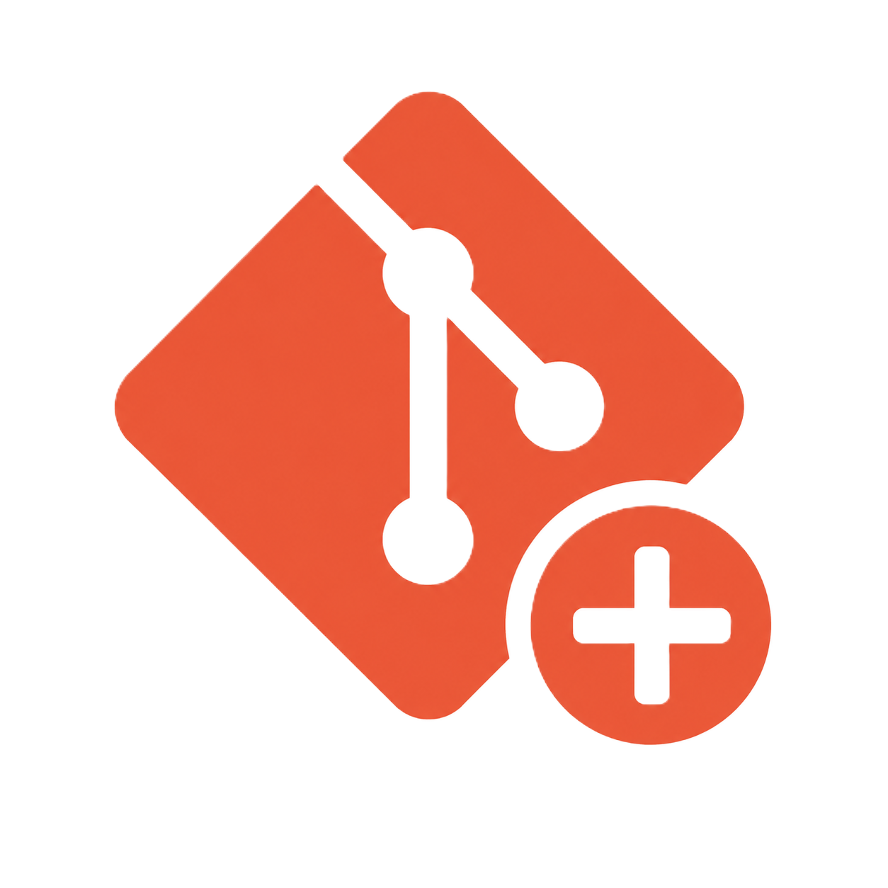
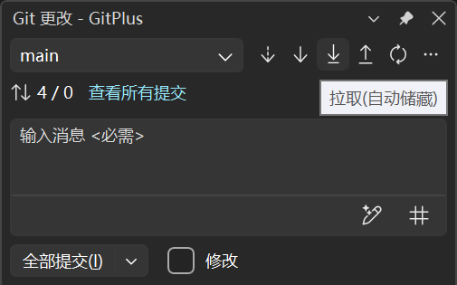

<p align="center">
  
</p>

<h1 align="center">Git +</h1>

<p align="center">
  <strong>Visual Studio Git 增强扩展</strong>
  <br />
  在 VS 内置 Git 工具之上，提供工具栏按钮、自动 Fetch 和智能同步功能。
</p>

<p align="center">
  <a href="README.md">English Documentation</a>
</p>

---

## ✨ 功能

### 🔄 拉取（自动储藏）

一键拉取，自动处理本地更改。**Pull with Stash（拉取+储藏）** 按钮被注入到 Git 更改窗口工具栏，紧邻原生 Pull 按钮。点击后：

1. 通过 `git status` 检查本地更改
2. 如有本地更改，自动储藏（`git stash push`）
3. 执行 `git pull`（可选 `--rebase`）
4. 恢复储藏（`git stash pop`）

告别"存在未提交的更改，无法拉取"的错误——快速同步代码而不中断工作流。

### ⏱️ 自动 Fetch

按可配置的时间间隔，在后台定期执行 `git fetch --all --prune`。无需手动操作即可保持与远程仓库同步。自动 Fetch 的间隔信息会显示在 Fetch 按钮的提示文本中。

### ⚙️ 可配置选项

所有选项可通过 **工具 → 选项 → Git +** 访问：

| 类别 | 选项 | 默认值 | 描述 |
|----------|--------|---------|-------------|
| 常规 | 超时（秒） | 30 | Git 操作超时时间 |
| 常规 | Git 文件路径 | *(系统 PATH)* | 自定义 `git.exe` 路径 |
| 自动 Fetch | 启用自动 Fetch | ✅ 开 | 开启/关闭后台自动 Fetch |
| 自动 Fetch | Fetch 间隔（分钟） | 5 | 自动 Fetch 调用间隔 |
| 拉取 | 拉取时使用 Rebase | ✅ 开 | 使用 `--rebase` 代替合并 |
| 日志 | 日志级别 | 信息 | Git + 输出窗格的日志详细程度 |

### 🌐 本地化

扩展界面支持英文和简体中文（zh-Hans）两种语言。

---

## 📸 截图

<p align="center">
  
</p>

*注入到 Git 更改窗口工具栏中的 **Pull with Stash（拉取+储藏）** 按钮，与原生 Fetch、Pull、Push 按钮并列显示。*

---

## 📦 安装

### 前提条件

- **Visual Studio 2022**（版本 17.14 或更高）
- **.NET Framework 4.7.2** 或更高

### 通过 VSIX 安装

从 [Releases](https://github.com/View12138/GitPlus/releases) 下载 `.vsix` 文件，双击安装。或从源码构建：

```powershell
dotnet build GitPlus.slnx -c Release
```

生成的 `.vsix` 文件位于：
```
GitPlus/bin/Release/net472/GitPlus.vsix
```

---

## 🛠️ 开发

### 技术栈

- **目标框架**：`net472`（VS 进程内扩展）
- **语言**：C# 14（record、模式匹配、file-scoped namespace）
- **核心库**：
  - `Microsoft.VisualStudio.SDK` — VS 扩展性
  - `CommunityToolkit.Mvvm` — `AsyncRelayCommand`
  - `Lombok.NET` — `[RequiredArgsConstructor]` 源码生成注入
  - `Microsoft.Extensions.DependencyInjection` — DI 容器
  - `Microsoft.Extensions.Logging.Abstractions` — 结构化日志

### 项目结构

```
GitPlus/
├── GitPlusPackage.cs              # AsyncPackage 入口
├── Configurations/
│   └── GitPlusOptionPage.cs       # 工具 → 选项 对话框页
├── Injectors/
│   ├── InjectorBase.cs            # UI 注入器抽象基类
│   └── GitWindowActionButtonPanelInjector.cs
├── Services/
│   ├── WindowWatcher.cs           # DTE 窗口生命周期事件
│   ├── GitCommandService.cs       # git.exe 进程封装
│   └── AutoFetchService.cs        # 定时自动 Fetch
├── Commons/
│   ├── Extensions.cs              # DI / WPF VisualTree 辅助方法
│   ├── GitResult.cs               # Git 操作结果模型
│   ├── GitWindowLocator.cs        # VisualTree 元素定位器
│   └── GitWindowViewModelExtensions.cs
└── Resources/
    ├── GitButtonStyle.xaml        # ImageButton 控件模板
    └── Icons.xaml                 # DrawingImage 矢量图标

GitPlus.Tests/                     # xunit + Moq 测试项目
```

### 构建

```powershell
dotnet build GitPlus.slnx
```

### 运行测试

```powershell
dotnet test GitPlus.slnx
```

### 调试 (F5)

在 Visual Studio 中打开解决方案，将 `GitPlus` 设为启动项目，按 **F5** — 这会启动 VS 实验实例并加载扩展。

---

## 🧪 测试

`GitPlus.Tests` 项目使用 **xunit** + **Moq**，目标框架为 `net472`，并引用 WPF 程序集以支持基于 `DependencyObject` 的测试。

---

## 📄 许可证

本项目基于 MIT 许可证开源 — 详见 [LICENSE.txt](LICENSE.txt)。

---

<p align="center">
  <sub>Made with ❤️ by <strong>View</strong></sub>
</p>
